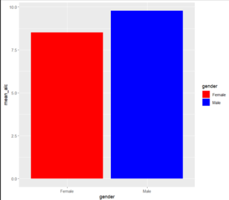

# The Relationship Between Alcohol Consumption and Additional Factors with Physical Health

## Abstract

The research question attempted to answer was *"How much alcohol consumed start to affect a person's health? What other factors can be considered alongside alcohol in affect to a person's health?"* This focuses on individuals who took a survey provided by the Centers for Disease Control and Prevention (CDC) with data from 2017-2020. This research topic is important due to how popular alcohol culture is, not only within the United States, but globally.

Multiple data sets were used for this research including demographics, alcohol use, and blood pressure and cholesterol. The data sets were merged together into one and had their columns renamed due to the provided labels being unclear to what they stood for. Two main variables had been used as predictors for the condition of an individual's blood pressure and cholesterol level: consumption of alcohol and the gender of an individual.

Results show that on average, males tend to consume more alcohol than females, which can affect how the data is perceived, as it is more likely that males may have a higher output in data of having high blood pressure and cholesterol as opposed to females. Additionally, in comparison to average alcohol consumption daily and these health conditions, 4 or 5 drinks showed the most correlation to high blood pressure and cholesterol levels. Through Chi-Square testing, results showed that alcohol did have an affect on high blood pressure, but not high cholesterol. Gender had affect on both.

## Background

In the United States, over 86 percent of adults admit to having at least one drink of alcohol throughout their life. Annually, over 140,000 people die from alcohol-related causes. In the United States alone, alcohol is the fourth-leading preventable cause of death. Alcohol-related deaths are consisted of many factors, however some of the most common are hypertension and kidney failure. Health problems such as the ones listed can lead to other conditions and issues as well, such as heart failure and more.

The data sets used come from the Centers for Disease Control and Prevention (CDC)'s website. It is from the from the 2017-2020 Pre Pandemic National Health and Nutrition Examination Survey (NHANES) Questionnaire. All information is from before the COVID-19 pandemic as stated so data may be different from current day situations. Unfortunately, there was no data from 2020-2023 available to compare. The data sets used from the surveys were demographics, alcohol use, and blood pressure and cholesterol.

## Results

### Figure 1

## Bibliography

<https://www.cdc.gov/alcohol/fact-sheets/alcohol-use.htm>

<https://www.niaaa.nih.gov/alcohols-effects-health/alcohol-topics/alcohol-facts-and-statistics/alcohol-related-emergencies-and-deaths-united-states#:~:text=It%20is%20estimated%20that%20more,physical%20inactivity%2C%20and%20illegal%20drugs.>

<https://www.caron.org/blog/the-american-alcohol-problem>
