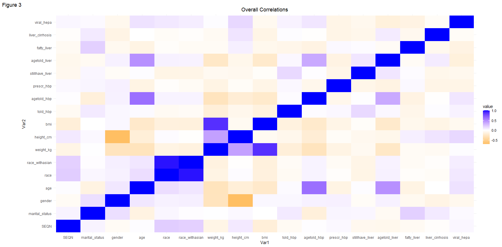

---
output:
  html_document:
    theme: paper
  pdf_document: default
---

------------------------------------------------------------------------

::: {align="center"}
# The Relationship Between Liver Disease & Hypertension, And The Role Of Demographics

## By: Vincent Sanchez
:::

### Abstract

The research question I set out to answer was "What is the correlation between liver conditions and hypertension in 21-80 year old Americans, and how do different demographics play a role in this correlation?" This research topic may save the lives of millions of people, as it is estimated that 80 million adults in the U.S. have fatty liver disease but are not aware of it (American Liver Foundation). Additionally, about 122 million adults in the U.S. have hypertension (Mark D. Huffman). This means that both of these health conditions are extremely prevalent in modern society.

The data was grouped based on all variables relating to liver conditions, hypertension, and any overall demographic categories. After combining all variables to a single dataset, the resulting amount of total observations was 2,918. Processes of hypothesis testing and machine learning were then performed to predict diagnosis ages of those with hypertension and liver conditions.

One main finding from the research was that on average, an individual is told they have hypertension before they are told they have a liver condition. It was also found that the majority of those with a liver condition also have hypertension. The data also showed that marriage has no effect on whether or not you are diagnosed with hypertension or a liver condition and that hispanic people are more likely to have a liver condition than black, white, and multi-racial people.

These findings are important because the results make us closer to understanding any potential causes of both liver conditions and hypertension and how we can potentially prevent them in the near future.

### Background

I have a family member that has been diagnosed with both non-alcoholic fatty liver disease and hypertension, and my concern for their health has been the inspiration for this research project. Wondering what could be a potential cause of their conditions and the conditions of millions of other U.S. adults, I developed the research question of "What is the correlation between liver conditions and hypertension in 21-80 year old Americans, and how do different demographics play a role in this correlation?"

This research question was answered with the use of data from the National Health and Nutrition Exam Survey, specifically the 2017-2020 pre-pandemic cycles. The data is nationally representative and covers a variety of health topics surveyed to and tested on individuals. Demographics, body measurements, blood pressure & cholesterol, and medical conditions were the specific datasets that I chose for this research project.

### Results

Both Figures 1 & 2 are comparing the same 2 variables; one being if the surveyed individual has been diagnosed with a liver condition, and the other being if the same individual has been diagnosed with hypertension.

Figure 1 showcases how the *minority* of those with hypertension also have a liver condition. The "Count" variable on the y-axis represents the amount of people in each category, and this same variable is also applied in several of the upcoming graphs.

Figure 2, however, displays how the *majority* of those with a liver condition also have hypertension.

Figure 3 is a correlation plot of all the different variables in the dataset. This correlation plot only calculates linear correlations. That being said, the plot shows a potential correlation between specifically the `agetold_liver` variable and `agetold_hbp` variable, representing the diagnosis ages.

To take a closer look at the correlation between the diagnosis ages of hypertension and liver conditions, I created a line-of-best-fit graph (Figure 4) to determine this relationship. What you can notice here is that the different age variables are not of an exact 1:1 proportion, but rather of an exponential or a slower linear proportion.

I did hypothesis testing to see if, on average, the age an individual is told they have a liver condition is greater than, less than, or overall different than the age they are told they have hypertension. Specifically, I performed a series of t-tests.

Figure 5 shows the results of these different hypothesis t-tests in terms of their p-values, and the threshold of what a significant p-value is considered to be (below 0.05). The test that proved to be significant was that, on average, the age an individual was told they had a liver condition is greater than the age they were told they had hypertension.

Figure 6 compares the marital status of a surveyed individual and whether or not they are currently prescribed for hypertension. There is no correlation because the proportions of the prescription variable remain about the same in each category of marital status.

Figure 7 compares the same marital status variable in Figure 6 but with if they have been diagnosed with a liver condition. This graph has the same results as the first one, where there is no correlation because the proportions each marital status category are the same.

Figure 8 compares the race of the surveyed individual and whether or not they have a liver condition. The "Mexican" and "other Hispanic" races have a larger ratio of those with a liver condition than those without when compared to the other race categories.

Lastly, I created 3 machine learning models for regression. The objective with these models was to predict the age an individual would be diagnosed with hypertension based on all other variables of the dataset including the diagnosis age for a liver condition.

Figure 9 graphs a comparison of the mean absolute errors for the different models. The mean absolute error, considering the scale of the specific dataset, should not exceed about 4.94 for ideal model accuracy. Since all 3 regression models are above this threshold, this means that the models are inaccurate and are not a good prediction tool to predict an individual's diagnosis age for hypertension.

### Discussion

Limitations of the data include not being able to verify if the surveyed individuals reported some of their information correctly, and there being many more initial NA values in some variables than others. A limitation of the methods used is that I only implemented methods that I learned during the DSRP, as this research opportunity was my first exposure to data science. Taking these things into consideration, I utilized the data to the best of my ability to come to meaningful conclusions.

The key conclusions that can be drawn from the data are the following:

-   The majority of those with a liver condition have hypertension

-   The minority of those with hypertension have a liver condition

-   It is most probable to be diagnosed with hypertension before you are diagnosed with a liver condition

-   Marriage has no effect on whether you are diagnosed with hypertension or a liver condition

-   Hispanic people are more likely to have a liver condition than Black, White, and multi-racial people

These conclusions fit the common theme of discussing the correlation between liver conditions and hypertension, as well as any roles that demographics play in these correlations. With these key conclusions, we are closer to understanding the potential causes of both liver conditions and hypertension and how we could possibly prevent them in the future in order to save millions of lives.

Next steps could include gathering more data to increase the scale and predictability, exploring in conjunction with other datasets to widen the scope of any potential underlying causes of either hypertension or liver conditions, and building more machine learning models of varying types to predict or classify the wide range of variables.

### Code & Data Sources

The datasets used in this research project can be found [***here***](https://wwwn.cdc.gov/nchs/nhanes/continuousnhanes/default.aspx?Cycle=2017-2020).

The GitHub repository with the code from this project can be found [***here***](https://github.com/the-codingschool/DSRP-2023-DiDonato) (under the `Vincent Sanchez` folder).

### Acknowledgements

I would like to personally acknowledge the following individuals:

-   AJ DiDonato for serving as a mentor and guiding team leader.

-   Yijia Wang for providing technical assistance when needed.

-   Sarah Parker for teaching all of the required concepts for this project.

*I would also like to give extra thanks to the whole team behind the Data Science Research Program with Columbia University, as the entire foundation of this project would not be possible without their guidance!*
